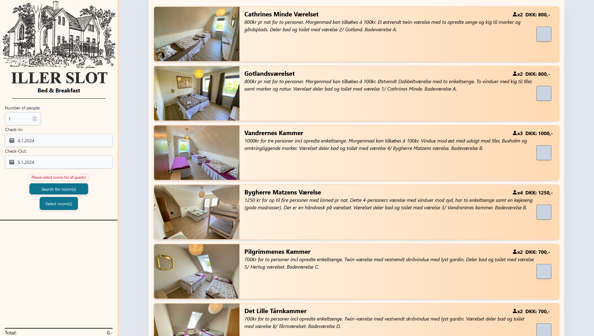
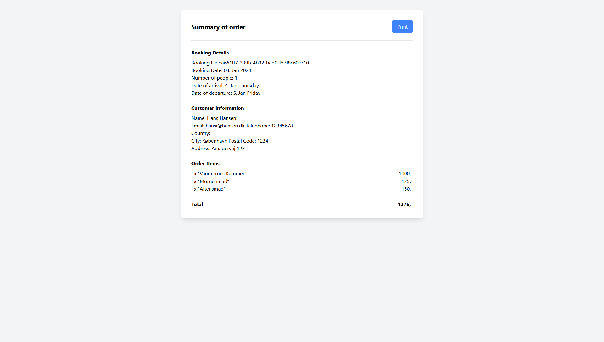

# D21 Bed & Breakfast Booking System (BBBS)
This project was part of my final examination for my CS degree.\
It was done as a solo project, with a time span of 10 weeks.

## The system is comprised of: 
 - Frontend, written using:
   - React, Flowbite, Tailwindcss
 - Backend, written using:
   - C#, Asp.Net

The development and deployment of both the frontend and backend is facilitated by a DevOps environment, that builds the projects and deploys them to docker containers.

## Images

